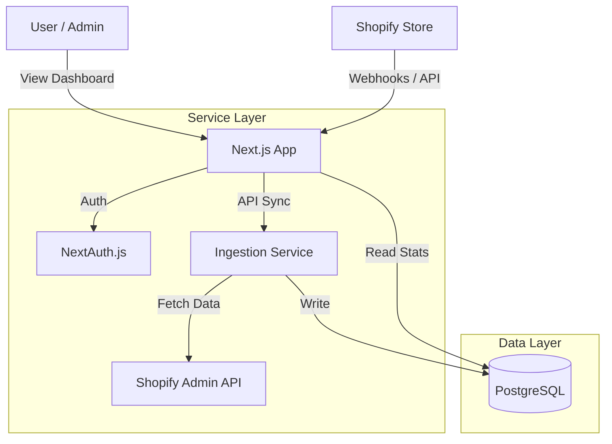

# Shopify Integration Service Documentation

## Assumptions
1.  **Multi-tenancy**: Each "store" is treated as a tenant. We assume a single database with a `tenantId` column for isolation (Row-Level Security could be added for stricter isolation).
2.  **Authentication**: We assume a simple email/password auth for the dashboard for now. In a real Shopify app, we would use Shopify's OAuth for embedded apps.
3.  **Sync Frequency**: We assume a manual sync trigger or webhook-based approach. The current implementation provides an API endpoint to trigger sync.
4.  **Data Volume**: We assume a moderate amount of data. For high-volume stores, we would need background jobs (e.g., BullMQ, Redis) to handle ingestion asynchronously.

## High-Level Architecture

## APIs and Data Models

### Data Models (Drizzle Schema)
-   **Tenants**: Stores Shopify credentials (`accessToken`, `storeDomain`).
-   **Customers**: Synced customer data (`shopifyId`, `email`, `totalSpent`).
-   **Products**: Synced product data (`shopifyId`, `title`, `status`).
-   **Orders**: Synced order data (`shopifyId`, `totalPrice`, `financialStatus`).
-   **Users**: Dashboard users.

### API Endpoints
-   `POST /api/sync`: Triggers data synchronization for a tenant.
    -   Body: `{ "tenantId": 1 }`
-   `GET /api/auth/*`: Handles authentication.

## Next Steps to Productionize
1.  **Webhooks**: Implement Shopify Webhook verification and handling (e.g., `orders/create`, `customers/update`) to keep data real-time without manual sync.
2.  **Background Jobs**: Use a queue (Redis/BullMQ) for the sync process to avoid timeouts on large stores.
3.  **Security**:
    -   Encrypt `accessToken` in the database.
    -   Implement strict Row-Level Security (RLS) in Postgres.
4.  **Testing**: Add comprehensive unit and integration tests.
5.  **Deployment**: Deploy to Vercel (Frontend/API) and Neon/Supabase (Database).
