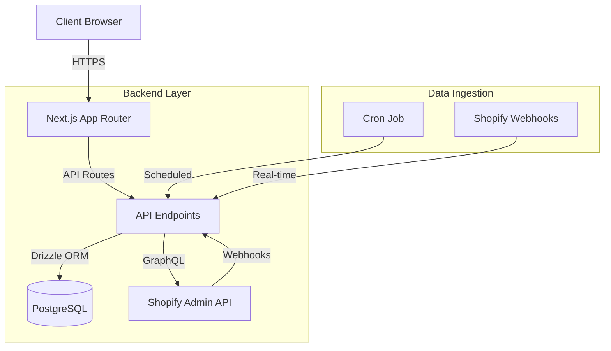
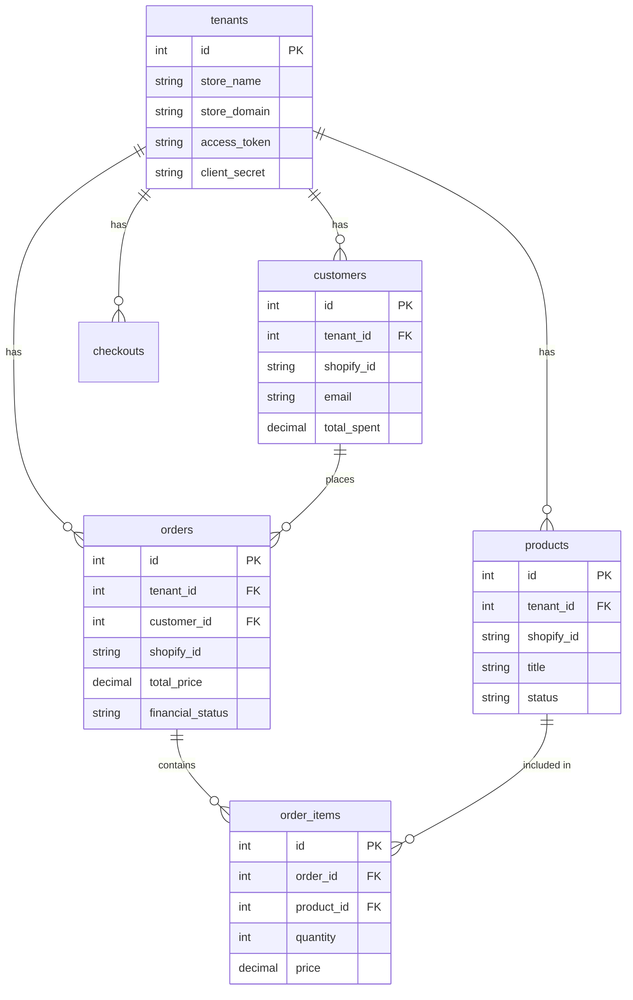

# Xeno

Xeno is a multi-tenant Shopify analytics and dashboard application built with Next.js 16, Drizzle ORM, and PostgreSQL. It ingests data from Shopify stores via GraphQL API and Webhooks to provide insights on customers, products, and orders.

## 🚀 Setup Instructions

### Prerequisites
- Node.js 18+
- PostgreSQL Database
- Shopify Partner Account (for App credentials)

### Installation

1.  **Clone the repository:**
    ```bash
    git clone <repository-url>
    cd xeno
    ```

2.  **Install dependencies:**
    ```bash
    npm install
    ```

3.  **Environment Configuration:**
    Copy `.env.example` to `.env` and fill in the required values:
    ```bash
    cp .env.example .env
    ```
    
    **Required Variables:**
    - `DATABASE_URL`: Connection string for your PostgreSQL database.
    - `AUTH_SECRET`: Secret key for NextAuth.js (generate with `openssl rand -base64 32`).
    - `CRON_SECRET`: Secret token to secure the ingestion cron job.
    - `APP_URL`: The public URL of your application .
    - `SHOPIFY_API_SECRET`: (Optional) Global fallback for webhook HMAC verification if per-tenant secret is missing.
    - `RABBITMQ_URL`: Connection URL for your RabbitMQ instance (e.g., `amqps://...` from CloudAMQP or `amqp://localhost` for local).

4.  **Database Migration:**
    Push the schema to your database:
    ```bash
    npx drizzle-kit push
    ```

5.  **Run Development Server:**
    ```bash
    npm run dev
    ```

    Open [http://localhost:3000](http://localhost:3000) to view the app.

6.  **Run Background Worker (Optional by default, required for Async Jobs):**
    Open a new terminal and run:
    ```bash
    npm run worker
    ```
    This process consumes messages from RabbitMQ to handle asynchronous tasks like data ingestion.

## 🏗️ Architecture

Xeno follows a modern full-stack architecture using the Next.js App Router.



### Tech Stack
-   **Framework**: Next.js 16 (App Router)
-   **Database**: PostgreSQL
-   **ORM**: Drizzle ORM
-   **Styling**: Tailwind CSS
-   **Auth**: NextAuth.js
-   **Validation**: Zod
-   **Messaging**: RabbitMQ (amqplib)

## 🔌 API Endpoints

| Method | Endpoint | Description | Auth Required |
| :--- | :--- | :--- | :--- |
| `POST` | `/api/register` | Register a new dashboard user. | No |
| `POST` | `/api/tenants` | Register a new Shopify store (tenant). | Yes (Session) |
| `POST` | `/api/sync` | Trigger a manual data sync for a tenant. | Yes (Session) |
| `GET` | `/api/cron/ingest` | Scheduled job to sync data from Shopify. | `Bearer <CRON_SECRET>` |
| `POST` | `/api/webhooks/shopify` | Handle Shopify webhooks (`orders/create`, etc). | HMAC Signature |

## 🗄️ Database Schema

The database is designed for multi-tenancy, where each record is linked to a `tenant_id`.



## ⚠️ Known Limitations & Assumptions

1.  **Single Currency**: The application currently assumes reports and aggregations are in the store's primary currency. Multi-currency conversion is not yet implemented.
2.  **Shopify Dependency**: The app relies heavily on Shopify's API availability and rate limits.
3.  **Data Freshness**: While webhooks provide near real-time updates, some data might only be updated during the scheduled cron sync.
4.  **Tenant Isolation**: Data isolation is enforced at the application level (via `tenant_id` in queries). Ensure all custom queries include this filter.
